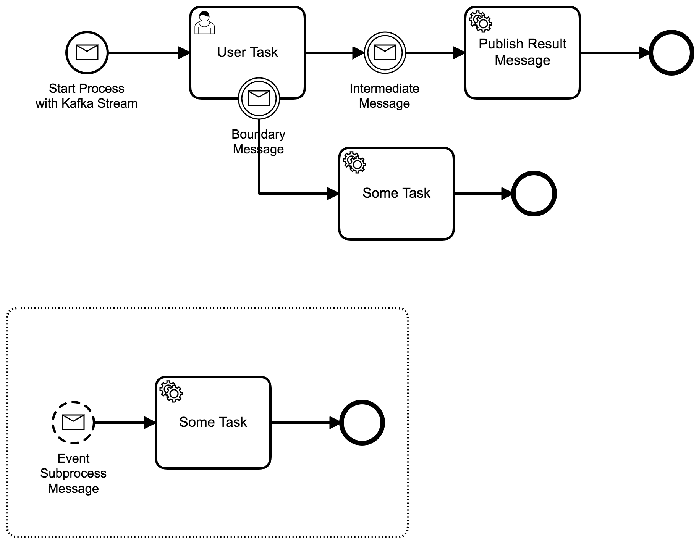

# Kafka Camunda Example
A sample Camunda process that interacts with Kafka. 

## Show me the important parts!


## How does it work?

The application has a [Rest API Controller](src/main/java/org/camunda/bpm/demo/controller/MessageProcessRestController.java) that post messages in two topics: **start-process-message-topic** and **intermediate-message-topic**. The request body of the api uses the POJO [CamundaMessageDto](src/main/java/org/camunda/bpm/demo/dto/CamundaMessageDto.java).

Those two topics are also listened by two methods in a [Consumer Class](src/main/java/org/camunda/bpm/demo/consumer/MessageProcessConsumer.java). One method can trigger a message start and another a message intermediate event.

The functionality to correlate a Camunda message is available in the [Message Service Class](src/main/java/org/camunda/bpm/demo/consumer/MessageService.java).

Last but not least, the service task after the intermediate message posts a message back into Kafka in the topic **service-task-message-topic**.

This project was heavily based in the following tutorial: https://www.baeldung.com/spring-kafka

For more information on Camunda message correlation, please check: https://docs.camunda.org/manual/7.12/reference/bpmn20/events/message-events/

## How to use it?
Start Apache Kafka in the default manner. Please check it here: https://kafka.apache.org/quickstart 

The topics configuration is done automatically by the class [KafkaTopicConfig](src/main/java/org/camunda/bpm/demo/config/KafkaTopicConfig.java).

You can start by running a POST against the endpoint **http://localhost:8080/message-process/start**:

```
{
	"correlationId":"12345",
	"dto":{
		"requester":"someone asked for it...",
		"amount":1000,
		"preApproved":true
	}
}
```

This will create an instance of the process showed above by posting a message to a topic "start-process-message-topic". This message is picked up by the listener in the class [StartMessageProcessConsumer](src/main/java/org/camunda/bpm/demo/consumer/StartMessageProcessConsumer.java) and will correlate the start event message event.

You can finish the intermediate message by running a POST against the endpoint **http://localhost:8080/message-process/intermediate**

```
12345
```

You should use the same correlation id as before, so you can consume the message of the process that was created.

At the end of the process, you should see a JSON posted in the topic **service-task-message-topic**.

## Environment Restrictions
This project uses Camunda 7.12.5-ee with Spring Boot.

## Known Limitations

Event subprocess can be implemented by listening a message.

Also, tests can be provided to validate the integration test capabilities with Apache Kafka.